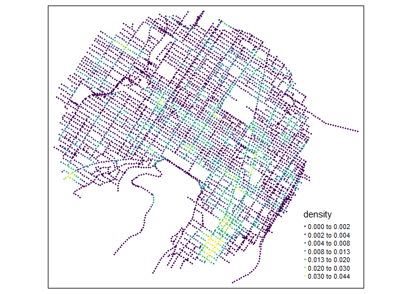
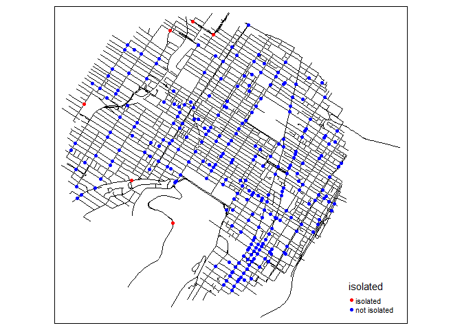

<!-- README.md is generated from README.Rmd. Please edit that file -->

# spNetwork 

## A R package to perform spatial analysis on networks.

<!-- badges: start -->

[](https://github.com/JeremyGelb/spNetwork/actions/workflows/R-CMD-check.yaml)
[](https://github.com/https://jeremygelb.github.io/spNetwork/)
[](https://cran.r-project.org/package=spNetwork)
[](https://cran.r-project.org/package=spNetwork)
[](https://cran.r-project.org/package=spNetwork)
[](https://codecov.io/gh/JeremyGelb/spNetwork?branch=master)
<!-- badges: end -->

The package’s website is available
[here](https://jeremygelb.github.io/spNetwork/)

## What is this package ?

This package can be used to perform several types of analysis on
geographical networks. This type of network have spatial coordinates
associated with their nodes. They can be directed or undirected. In the
actual development version the implemented methods are:

-   Network Kernel Density Estimate, a method estimating density of a
    point pattern constrained on a network (see the vignettes [Network
    Kernel Density
    Estimate](https://jeremygelb.github.io/spNetwork/articles/NKDE.html)
    and [Details about
    NKDE](https://jeremygelb.github.io/spNetwork/articles/NKDEdetailed.html)).
-   Spatial weight matrices based on network distances, which can be
    used in a great number of traditional methods in spatial analysis
    (see the vignette [Spatial Weight
    Matrices](https://jeremygelb.github.io/spNetwork/articles/SpatialWeightMatrices.html)).
-   Network k Functions, used to investigate the spatial distribution of
    a set of points on a network at several scales (see the vignette
    [Network k
    Functions](https://jeremygelb.github.io/spNetwork/articles/KNetworkFunctions.html)).
-   K nearest neighbours, to calculate for each point on a network its K
    nearest neighbour (see the function `network_knn`).
-   Graph analysis, using the functions of the package **igraph** (see
    the vignette [Building
    graphs](https://jeremygelb.github.io/spNetwork/articles/NetworkBuilding.html))
-   Isochrones, to delineate accessible area around points localized on
    a network (see the vignette [Calculating
    isochrones](https://jeremygelb.github.io/spNetwork/articles/Isochrones.html))

Calculation on network can be long, efforts were made to reduce
computation time by implementing several core functions with **Rcpp**
and **RcppArmadillo** and by using multiprocessing when possible.

## Installing

you can install the CRAN version of this package with the following code
in R.

``` r
install.packages("spNetwork")
```

To use all the new features before they are available in the CRAN
version, you can download the development version.

``` r
devtools::install_github("JeremyGelb/spNetwork")
```

The packages uses mainly the following packages in its internal
structure :

-   igraph
-   sp
-   rgeos
-   maptools
-   raster
-   future
-   future.apply
-   data.table
-   SearchTrees
-   Rcpp
-   RcppArmadillo

## Some examples

We provide here some short examples of several features. Please, check
the vignettes for more details.

-   realizing a kernel network density estimate

``` r
library(spNetwork)
library(tmap)
library(rgdal)

# loading the dataset
networkgpkg <- system.file("extdata", "networks.gpkg",
                           package = "spNetwork", mustWork = TRUE)
eventsgpkg <- system.file("extdata", "events.gpkg",
                          package = "spNetwork", mustWork = TRUE)
mtl_network <- readOGR(networkgpkg,layer="mtl_network",verbose = FALSE)
bike_accidents <- readOGR(eventsgpkg,layer="bike_accidents", verbose = FALSE)


# generating sampling points at the middle of lixels
samples <- lines_points_along(mtl_network, 50)

# calculating densities
densities <- nkde(mtl_network,
                 events = bike_accidents,
                 w = rep(1,nrow(bike_accidents)),
                 samples = samples,
                 kernel_name = "quartic",
                 bw = 300, div= "bw",
                 method = "discontinuous",
                 digits = 2, tol =  0.1,
                 grid_shape = c(1,1),
                 max_depth = 8,
                 agg = 5, sparse = TRUE,
                 verbose = FALSE)

densities <- densities*1000
samples$density <- densities


tm_shape(samples) + 
  tm_dots(col = "density", size = 0.05, palette = "viridis",
          n = 7, style = "kmeans")
```

 \* Building
a spatial matrix based on network distance

``` r
library(spdep)

# creating a spatial weight matrix for the accidents
listw <- network_listw(bike_accidents,
                       mtl_network,
                       mindist = 10,
                       maxdistance = 400,
                       dist_func = "squared inverse",
                       line_weight = 'length',
                       matrice_type = 'W',
                       grid_shape = c(1,1),
                       verbose=FALSE)

# using the matrix to find isolated accidents (more than 500m)
no_link <- sapply(listw$neighbours, function(n){
  if(n == 0){
    return(TRUE)
  }else{
    return(FALSE)
  }
})

bike_accidents$isolated <- as.factor(ifelse(no_link,
                                  "isolated","not isolated"))

tm_shape(mtl_network) + 
  tm_lines(col = "black") +
  tm_shape(bike_accidents) + 
  tm_dots(col = "isolated", size = 0.1,
          palette = c("isolated" = "red","not isolated" = "blue"))
```


Note that you can use this in every spatial analysis you would like to
perform. With the converter function of spdep (like listw2mat), you can
convert the listw object into regular matrix if needed

-   Calculating k function

``` r
# loading the data
networkgpkg <- system.file("extdata", "networks.gpkg",
                           package = "spNetwork", mustWork = TRUE)
eventsgpkg <- system.file("extdata", "events.gpkg",
                          package = "spNetwork", mustWork = TRUE)

main_network_mtl <- rgdal::readOGR(networkgpkg,layer="main_network_mtl", verbose = FALSE)
mtl_theatres <- rgdal::readOGR(eventsgpkg,layer="mtl_theatres", verbose = FALSE)

# calculating the k function
kfun_theatre <- kfunctions(main_network_mtl, mtl_theatres,
                           start = 0, end = 5000, step = 50, 
                           width = 1000, nsim = 50, resolution = 50,
                           verbose = FALSE, conf_int = 0.05)
kfun_theatre$plotg
```



### Work in progress

New methods will be probably added in the future, but we will focus on
performance for the next release. Do no hesitate to open an issue
[here](https://github.com/JeremyGelb/spNetwork/issues) if you have
suggestion or if you encounter a bug.

Features that will be added to the package in the future:

-   temporal NKDE, a two dimensional kernel density estimation in
    network space and time
-   accessibility measures based on distance matrix between population
    locations and services

## Authors

-   **Jeremy Gelb** - *Creator and maintainer*

## Contribute

To contribute to `spNetwork`, please follow these
[guidelines](https://github.com/JeremyGelb/spNetwork/blob/master/CONTRIBUTING.md).

Please note that the `spNetwork` project is released with a [Contributor
Code of
Conduct](https://github.com/JeremyGelb/spNetwork/blob/master/CONDUCT.md).
By contributing to this project, you agree to abide by its terms.

## License

`spNetwork` version 0.1.1 is licensed under [GPL2
License](https://github.com/JeremyGelb/spNetwork/blob/master/LICENSE.txt).

## Acknowledgments

-   Hat tip to Philippe Apparicio for his support during the development
-   Hat tip to Hadley Wickham and his helpful book *R packages*
