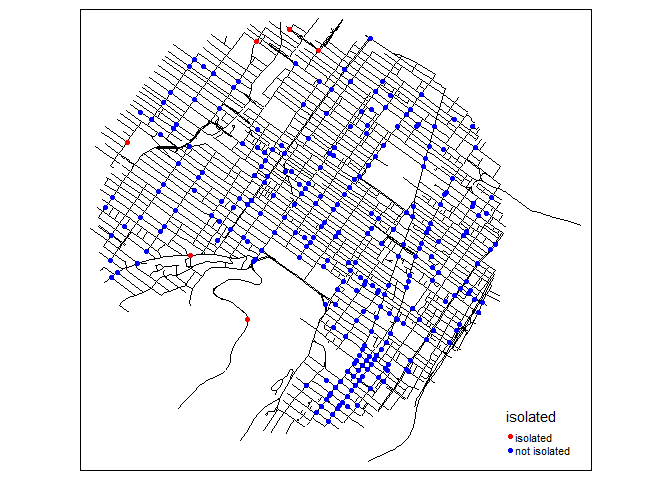
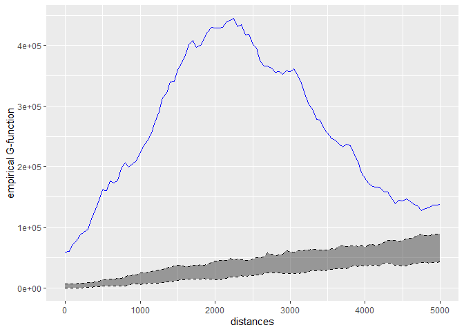

<!-- README.md is generated from README.Rmd. Please edit that file -->

# spNetwork 

## A R package to perform spatial analysis on networks.

<!-- badges: start -->

[](https://github.com/JeremyGelb/spNetwork/actions/workflows/R-CMD-check.yaml)

[](https://jeremygelb.github.io/spNetwork/)
[](https://cran.r-project.org/package=spNetwork)
[](https://cran.r-project.org/package=spNetwork)
[](https://cran.r-project.org/package=spNetwork)
[](https://app.codecov.io/gh/JeremyGelb/spNetwork?branch=master)
<!-- badges: end -->

The package’s website is available
[here](https://jeremygelb.github.io/spNetwork/)

## Breaking news

### Moving to sf

Considering that `rgeos` and `maptools` will be deprecated soon, we are
moving to sf! This requires some adjustment in the code and the
documentation. The development version and the releases on CRAN are now
using `sf`. Please, report any bug or error in the documentation.

To install the previous version using `sp`, `rgeos` and `maptools`, you
can run the following command:

``` r
devtools::install_github("JeremyGelb/spNetwork", ref = "a3bc982")
```

Note that all the new developments will use `sf` and you should switch
as soon as possible.

### Removing gpkgs

Because of a new CRAN policy, it is not possible anymore to read data in
gpkg if they are stored in the user library. On Debian systems, this
library is now mounted as read-only for checking. All the datasets
provided by spNetwork are now stored as .rda file, and can be loaded
with the function `data`.

## What is this package ?

This package can be used to perform several types of analysis on
geographical networks. This type of network have spatial coordinates
associated with their nodes. They can be directed or undirected. In the
actual development version the implemented methods are:

- Network Kernel Density Estimate, a method estimating density of a
  point pattern constrained on a network (see the vignettes [Network
  Kernel Density
  Estimate](https://jeremygelb.github.io/spNetwork/articles/NKDE.html)
  and [Details about
  NKDE](https://jeremygelb.github.io/spNetwork/articles/NKDEdetailed.html)).
- Temporal Network Kernel Density Estimate, a temporal extension of the
  previous methods [Temporal Network Kernel Density
  Estimate](https://jeremygelb.github.io/spNetwork/articles/TNKDE.html).
- Spatial weight matrices based on network distances, which can be used
  in a great number of traditional methods in spatial analysis (see the
  vignette [Spatial Weight
  Matrices](https://jeremygelb.github.io/spNetwork/articles/SpatialWeightMatrices.html)).
- Network k Functions, used to investigate the spatial distribution of a
  set of points on a network at several scales (see the vignette
  [Network k
  Functions](https://jeremygelb.github.io/spNetwork/articles/KNetworkFunctions.html)).
- K nearest neighbours, to calculate for each point on a network its K
  nearest neighbour (see the function `network_knn`).
- Graph analysis, using the functions of the package **igraph** (see the
  vignette [Building
  graphs](https://jeremygelb.github.io/spNetwork/articles/NetworkBuilding.html))
- Isochrones, to delineate accessible area around points localized on a
  network (see the vignette [Calculating
  isochrones](https://jeremygelb.github.io/spNetwork/articles/Isochrones.html))

Calculation on network can be long, efforts were made to reduce
computation time by implementing several functions with **Rcpp** and
**RcppArmadillo** and by using multiprocessing when possible.

## Installing

you can install the CRAN version of this package with the following code
in R.

``` r
install.packages("spNetwork")
```

To use all the new features before they are available in the CRAN
version, you can download the development version.

``` r
devtools::install_github("JeremyGelb/spNetwork")
```

The packages uses mainly the following packages in its internal
structure :

- igraph
- sf
- future
- future.apply
- data.table
- Rcpp
- RcppArmadillo
- BH

## Some examples

We provide here some short examples of several features. Please, check
the vignettes for more details.

- realizing a kernel network density estimate

``` r
library(spNetwork)
library(tmap)
library(sf)

# loading the dataset
data(mtl_network)
data(bike_accidents)


# generating sampling points at the middle of lixels
samples <- lines_points_along(mtl_network, 50)

# calculating densities
densities <- nkde(lines = mtl_network,
                 events = bike_accidents,
                 w = rep(1,nrow(bike_accidents)),
                 samples = samples,
                 kernel_name = "quartic",
                 bw = 300, div= "bw",
                 method = "discontinuous",
                 digits = 2, tol =  0.1,
                 grid_shape = c(1,1),
                 max_depth = 8,
                 agg = 5, sparse = TRUE,
                 verbose = FALSE)

densities <- densities*1000
samples$density <- densities

tm_shape(samples) + 
  tm_dots(col = "density", size = 0.05, palette = "viridis",
          n = 7, style = "kmeans")
```


An extension for spatio-temporal dataset is also available [Temporal
Network Kernel Density
Estimate](https://jeremygelb.github.io/spNetwork/articles/TNKDE.html)


- Building a spatial matrix based on network distance

``` r
library(spdep)

# creating a spatial weight matrix for the accidents
listw <- network_listw(bike_accidents,
                       mtl_network,
                       mindist = 10,
                       maxdistance = 400,
                       dist_func = "squared inverse",
                       line_weight = 'length',
                       matrice_type = 'W',
                       grid_shape = c(1,1),
                       verbose=FALSE)

# using the matrix to find isolated accidents (more than 500m)
no_link <- sapply(listw$neighbours, function(n){
  if(length(n) == 0){
    return(TRUE)
  }else{
    return(FALSE)
  }
})

bike_accidents$isolated <- as.factor(ifelse(no_link,
                                  "isolated","not isolated"))

tm_shape(mtl_network) + 
  tm_lines(col = "black") +
  tm_shape(bike_accidents) + 
  tm_dots(col = "isolated", size = 0.1,
          palette = c("isolated" = "red","not isolated" = "blue"))
```



Note that you can use this in every spatial analysis you would like to
perform. With the converter function of spdep (like listw2mat), you can
convert the listw object into regular matrix if needed

- Calculating k function

``` r
# loading the data
data(main_network_mtl)
data(mtl_theatres)

# calculating the k function
kfun_theatre <- kfunctions(main_network_mtl, mtl_theatres,
                           start = 0, end = 5000, step = 50, 
                           width = 1000, nsim = 50, resolution = 50,
                           verbose = FALSE, conf_int = 0.05)
kfun_theatre$plotg
```



### Work in progress

New methods will be probably added in the future, but we will focus on
performance for the next release. Do no hesitate to open an issue
[here](https://github.com/JeremyGelb/spNetwork/issues) if you have
suggestion or if you encounter a bug.

Features that will be added to the package in the future:

- temporal NKDE, a two dimensional kernel density estimation in network
  space and time
- rework for using `sf` objects rather than `sp` (`rgeos` and `maptools`
  will be deprecated in 2023). This work is undergoing, please report
  any bug or error in the new documentation.

## Reporting a bug

If you encounter a bug when using spNetwork, please open an *issue*
[here](https://github.com/JeremyGelb/spNetwork/issues). To ensure that
the problem is quickly identified, the issue should follow the following
guidelines:

1.  Provide an informative title and do not copy-paste the error message
    as the title.
2.  Provide the ALL code which lead to the bug.
3.  Indicate the version of R and spNetwork.
4.  If possible, provide a sample of data and a reproductible example.

## Authors

- **Jeremy Gelb** - *Creator and maintainer*

## Contribute

To contribute to `spNetwork`, please follow these
[guidelines](https://github.com/JeremyGelb/spNetwork/blob/master/CONTRIBUTING.md).

Please note that the `spNetwork` project is released with a [Contributor
Code of
Conduct](https://github.com/JeremyGelb/spNetwork/blob/master/CONDUCT.md).
By contributing to this project, you agree to abide by its terms.

## Citation

An article presenting `spNetwork` and NKDE has been accepted in the
RJournal!

Gelb Jérémy (2021). spNetwork, a package for network kernel density
estimation. The R Journal.
<https://journal.r-project.org/archive/2021/RJ-2021-102/index.html>.

You can also cite the package for other methods:

Gelb Jérémy (2021). spNetwork: Spatial Analysis on Network.
<https://jeremygelb.github.io/spNetwork/>.

## License

`spNetwork` is licensed under [GPL2
License](https://github.com/JeremyGelb/spNetwork/blob/master/LICENSE.txt).

## Acknowledgments

- Hat tip to Philippe Apparicio for his support during the development
- Hat tip to Hadley Wickham and his helpful book *R packages*
