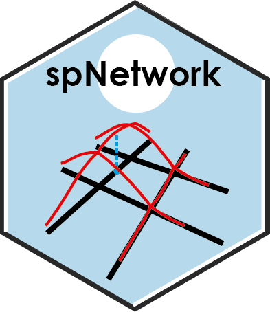

<!-- README.md is generated from README.Rmd. Please edit that file -->

# spNetwork 

## A R package to perform spatial analysis on networks.

<!-- badges: start -->

[](https://github.com/JeremyGelb/spNetwork/actions/workflows/R-CMD-check.yaml)
[](https://github.com/JeremyGelb/spNetwork)
[](https://cran.r-project.org/package=spNetwork)
[](https://cran.r-project.org/package=spNetwork)
<!-- badges: end -->

### Installing

spNetwork is available directly on CRAN, you can install it with the following command:
``` r
install.packages("spNetwork")
```
You can also install the current dev version which has more features.
``` r
devtools::install_github("JeremyGelb/spNetwork")
```

spNetwork uses mainly the following packages in its internal structure :

-   igraph
-   sp
-   rgeos
-   maptools
-   raster
-   future
-   future.apply
-   Rcpp
-   RcppArmadillo

## About the package

Perform spatial analysis on network. Allow to calculate Network Kernel Density Estimate, and to build spatial matrices (`listw` objects like in `spdep` package) to conduct any kind of traditional spatial analysis with spatial weights based on reticular distances. K functions on network are also available but still experimental. References: [Okabe et al (2019)](https://doi.org/10.1080/13658810802475491); [Okabe et al (2017)](https://doi.org/10.1007/978-3-319-23519-6_1648-1); [Baddeley el al (2015)](https://www.routledge.com/Spatial-Point-Patterns-Methodology-and-Applications-with-R/Baddeley-Rubak-Turner/p/book/9781482210200).

**spNetwork** is still under development, but the main features are available and have already been tested on large scale dataset.

## Getting Started

A good start point for this package is the vignettes. They present the
main features of the package.

```r{eval = FALSE}
vignette("NKDE","spNetwork")
vignette("NKDEdetailed","spNetwork")
vignette("SpatialWeightMatrices","spNetwork")
vignette("KNetworkFunctions","spNetwork")
```

### Examples

We provide here some short examples of the main features

-   realizing a kernel network density estimate

``` r
library(spNetwork)
data(mtl_network)
data(bike_accidents)
lixels <- lixelize_lines(mtl_network,200,mindist = 50)
samples <- lines_center(lixels)
densities <- nkde(mtl_network,
                 events = bike_accidents,
                 w = rep(1,nrow(bike_accidents)),
                 samples = samples,
                 kernel_name = "quartic",
                 bw = 300, div= "bw",
                 method = "discontinuous", digits = 1, tol = 1,
                 grid_shape = c(1,1),
                 verbose=FALSE)
```

-   Building a spatial matrix based on network distance and use it to
    calculate the Moran I with spdep.

``` r
library(spNetwork)
library(spdep)
data(mtl_network)

conv_function <- function(x){
  if(x<=500){
    return(1/x**2)
  }else{
    return(0)
  }
}

listw <- line_ext_listw_gridded(mtl_network,maxdistance=500,
       dist_func = conv_function, matrice_type='W',
       grid_shape = c(5,5),
       mindist = 10)

moran.test(mtl_network$nbAccident,listw, zero.policy = T)
```

Note that you can use this in every spatial analysis you would like to
perform. With the converter function of spdep (like listw2mat), you can
convert the listw object into regular matrix if needed.

### Work in progress

Currently, functions to calculate K-function and cross-K-function for
sets of points are available but still experimental.

We also added functions for bandwidth selection by likelihood
cross-validation.

## Authors

-   **Jeremy Gelb** - *Creator and maintainer*

## Contribute

To contribute to `spNetwork`, please follow these
[guidelines](https://github.com/JeremyGelb/spNetwork/blob/master/CONTRIBUTING.md).

Please note that the `spNetwork` project is released with a [Contributor
Code of
Conduct](https://github.com/JeremyGelb/spNetwork/blob/master/CONDUCT.md).
By contributing to this project, you agree to abide by its terms.

## License

`spNetwork` version 0.1.1 is licensed under [GPL2
License](https://github.com/JeremyGelb/spNetwork/blob/master/LICENSE.txt).

## Acknowledgments

-   Hat tip to Philippe Apparicio for its support during the development
-   Hat tip to Hadley Wickham and its helpful book *R packages*
