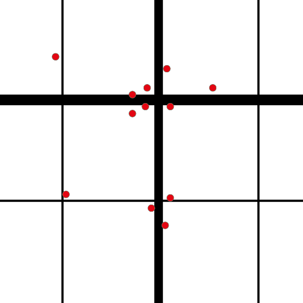
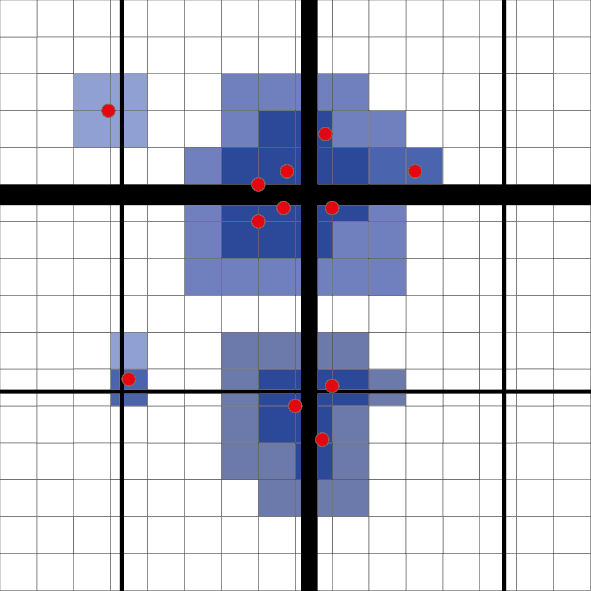
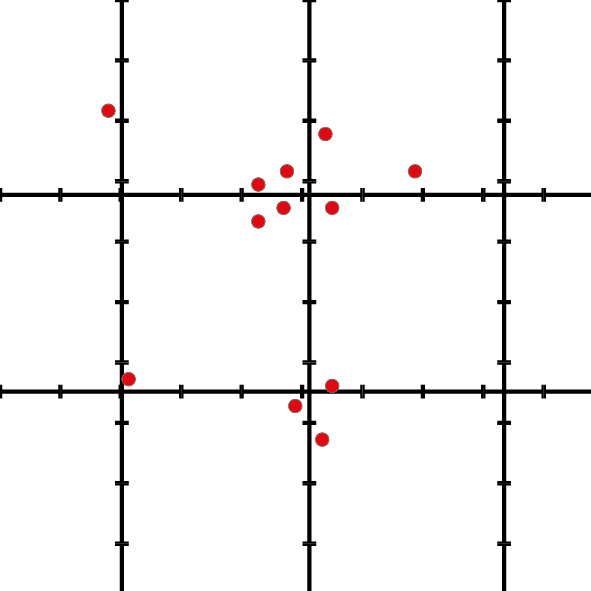
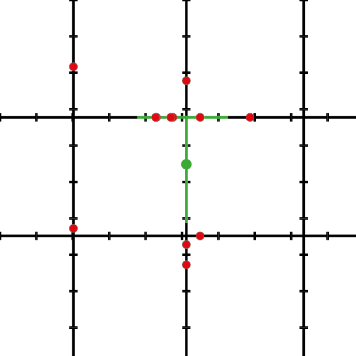
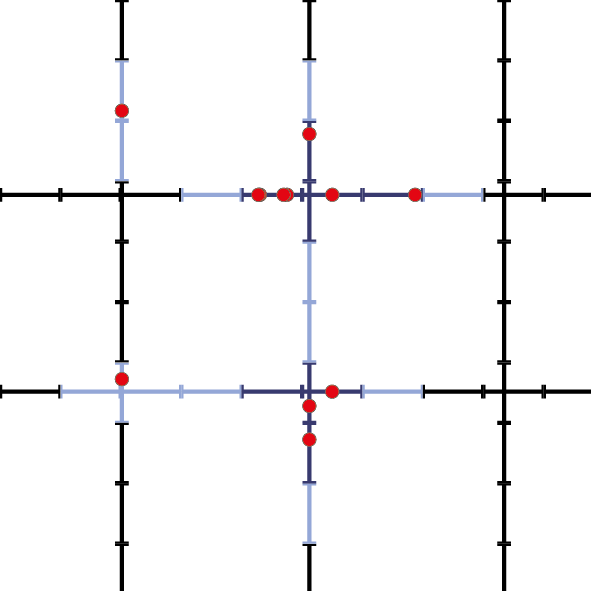

```{r setup, include = FALSE}
knitr::opts_chunk$set(
  collapse = TRUE,
  comment = "#>"
)
```


This vignette is a short introduction to the spNetwork packages. It will present the main features of the packages by using dataset provided with the package.


## Network Kernel Density Estimate

The first feature of the package is the Network Kernel Density Estimate (NKDE).

A classical KDE proposes to estimate the density of a phenomenom in a two dimensional space. That space is separated in pixels, and the density is estimated for each pixel.

This approach is not adapted to analyze density of events occuring on a network, like accidents in streets, or breaks on a network of water pipes etc. Indeed, calculating densities for locations outside the network is meaningless and the euclidean distance underestimate the real distance between two object on the network.

A NKDE extends the classical KDE by :

* using lixels intead of pixels. A lixel is a linear version of a pixel on a network. The lines of the network are splitted according to a chosen resolution.
* calculating reticular distances between objects instead of euclidean distances.

An image is worth 1000 words, so let's consider this situation : 
<center>
{width=300px}
</center>

Each point is an event and the lines constitute the network. One could realize a simple KDE on that dataset and would obtain something like :

<center>
{width=300px}
</center>

But this is only partly satisfying if we are interested on the density of the envents on the network.

To perform a NKDE, the lines of the network must be splitted into lixels : chunks of line of the same length. They are similar to pixels, but on a one dimensional space.

<center>
{width=300px}
</center>

The densities will be evaluated for the center of each lixel. The second step is to snapp the points to the network. At that point we have everything to perform the NKDE, we juste need to define ther kernel function and the kernel range.

The kernel range will be used to calculate wich event are close enough to the center of each lixel centers to be used in their density estimation.

<center>
{width=300px}
</center>

The final result would look like this picture :

<center>
{width=300px}
</center>

The *spNetwork* package make this type analyse straightforward to perform in R. The main problem of the implementation of the NKDE is to reduce computation time. Indeed, on a large dataset, building the network and evualating the distances between each event and each lixel center would be too long and could lead to memory issues.

To avoid this, the first solution provided in *spNetwork* is a grided application of the NKDE. The user can split the study area with a grid, the calculation is the performed on the observations in each cell of the grid. A buffer is applied on each cell to avoid frontier effect.

```{r}

#first load data and packages
#devtools::load_all("..")
library(spNetwork)
library(sp)
library(rgdal)
library(maptools)
library(rgeos)
data(mtl_network)
data(bike_accidents)

#then plotting the data
plot(mtl_network)
plot(bike_accidents,add=T,col='red')


# #then applying the NKDE
# lixels <- nkde_grided(mtl_network,bike_accidents,
#             snap_dist = 150,
#             lx_length=200,mindist=50,
#             kernel_range = 800, kernel='quartic',
#             weights=NULL, grid_shape = c(5,5),
#             show_progress = F)
# 
# #the generated lixels have the desired length
# hist(gLength(lixels,byid=T),breaks=50)
```

As you can imagine it remains a costly process, but a ambarassingly parallel one. Indeed, nothing make this process strictly sequential. The calculus of the NKDE of each cell could be done by different cores. *spNetwork* provided a function nkde_grided.mc, able to split the work between processes. More specifically, the function use functions from the packages *future* and *future.apply*. The selection of the plan is let to the user to permit the best compatibility on each platform. One could even paralellize this calculation on several computer.

Lets try to split the work between 4 cores.
```{r}

#setting the multiprocess plan
future::plan(future::multiprocess(workers=4))

#then applying the NKDE
lixels <- nkde_grided.mc(mtl_network,bike_accidents,
            snap_dist = 150,
            lx_length=200,mindist=50,
            kernel_range = 800, kernel='quartic',
            weights=NULL, grid_shape = c(5,5),
            show_progress = T)

```
