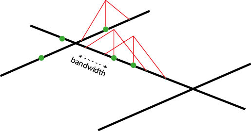
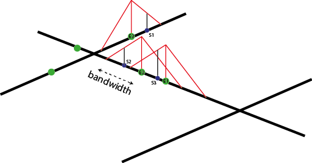
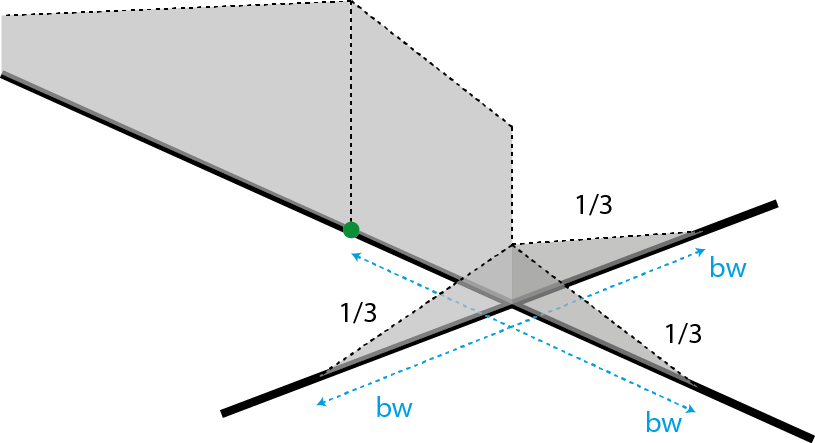
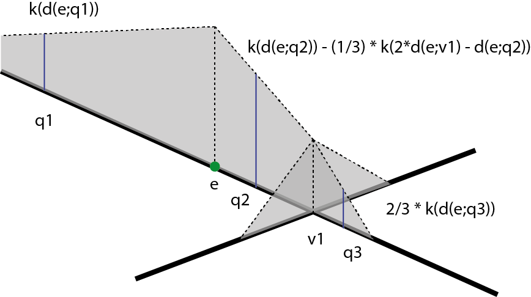

```{r setup, include = FALSE}
knitr::opts_chunk$set(
  collapse = TRUE,
  comment = "#>"
)
```


This vignette is a short introduction to the NKDE feature of the **spNetwork** package. It will present the main features of the package by using datasets provided with the package.


# Quick introduction to NKDE

The first feature of the package is the Network Kernel Density Estimate (NKDE).

A classical KDE proposes to estimate the continuous density of a set of events in a two dimensional space. The density is estimated at sampling points, traditionnaly the centers of pixel dividing in equal zones the study area.

This approach is not adapted to analyze density of events occuring on a network, like accidents and crimes in streets, or breaks on a network of water pipes. Indeed, calculating densities for locations outside the network is meaningless and the euclidean distance underestimates the real distance between two object on the network. Moreover, networks are not isotropic spaces, in other words, it is not possible to move in every direction, but only on the edges of the network.

To perform a NKDE, it is possible to 

* using lixels intead of pixels. A lixel is a linear equivalent of a pixel on a network. The lines of the network are splitted into lixels according to a chosen resolution. The centers of the lixels are sampling points for which the density will be estimated.
* calculating reticular distances between objects instead of euclidean distances.
* adjust the kernel function to deal with the anisotropic space

An image is worth 1000 words, so let us consider this situation : 
<center>
{width=300px}
</center>

Each red point is an event and the lines constitute the network. One could realize a simple KDE on that dataset and would obtain something like :

<center>
{width=300px}
</center>

But this is only partialy satisfying if we are interested in the density of the envents on the network.

To perform a NKDE, the events must be snapped on the network. The snapped events are shown here in green

<center>
{width=300px}
</center>

The density of each event can be seen as a third dimension and is evaluated by a selected kernel function (*K*) within a specified bandwidth. The kernel function must satisfied the following conditions :

$K(x) >= 0 \text{, if } x < bandwidth$
$K(x) = 0 \text{, if } x > bandwidth$
$\int K(x)dx= 1$

The total mass of an event is 1, and spread according to the function *K* within the bandwidth distance.

For an easy representation, let us consider here the triangle kernel function.

<center>
{width=300px}
</center>

We can see that the "influence" of each point is limited within the bandwidth and decreases when we are farther from an event.

With this setup, one can evaluate the density of the studied phenomenom at each point of the network. In the next figure, 3 sampling points (s1, s2 and s3) are added in blue.

<center>
{width=300px}
</center>

$d_{s1} = K(dist_{s1;e1})$
$d_{s2} = K(dist_{s2;e2})$
$d_{s3} = (1/2) * (K(dist_{s3;e2}) + K(dist_{s3;e3}))$

And in a more general fashion
$d_{si} = (1/n) * \sum_{j=1}^{n} K(dist_{si;ej})$
with *n* the number of events within the bandwidth arround the sampling point *si*


The proposed kernel function in the **spNetwork** package are :

* the gaussian kernel : $k(\dfrac{d_{il}}{r})=\dfrac{1}{\sqrt{2\pi}} * \exp(-\dfrac{d_{il}^2}{2r^2})$

* the quartic kernel : $k(\dfrac{d_{il}}{r})=\dfrac{3}{\pi} * (1-\dfrac{d_{il}^2}{r^2})$

* the epanechnikov kernel : $k(\dfrac{d_{il}}{r})=\dfrac{3}{4}*(1-\dfrac{d_{il}^2}{r^2})$

* the triangle kernel : 
$k(\dfrac{d_{il}}{r})= 1 - |\dfrac{d_{il}}{r}|$


```{r message=FALSE, warning=FALSE}
library(ggplot2)
library(reshape2)
library(kableExtra)
library(spNetwork)

x <- seq(-15,15,by = 0.01)
df <- data.frame(
  x = x,
  gauss = gaussian_kernel(x,15),
  epanechnikov = epanechnikov_kernel(x,15),
  quartic = quartic_kernel(x,15),
  triangle = triangle_kernel(x,15),
  tricube = tricube_kernel(x,15),
  triweight = triweight_kernel(x,15),
  cosine = cosine_kernel(x,15))

df2 <- melt(df, id.vars = "x")
names(df2) <- c("x","kernel","y")

ggplot(df2) + 
  geom_line(aes(x=x,y=y,color=kernel))

```
As you can see, most of the kernels looks alike. Only yhe gaussian kernel is flatter. It is worth mentionning that the gaussian kernel does not integrate to 1. This means that some weight of each event is lost with the gaussian kernel.

```{r message=FALSE, warning=FALSE}

Funs <- c(gaussian_kernel,epanechnikov_kernel,
          quartic_kernel,triangle_kernel,
          tricube_kernel,triweight_kernel,
          cosine_kernel)
Names <- c("gaussian", "epanechnikov", "quartic",
           "triangle", "tricube", "triweight", "cosine")
integrals <- sapply(Funs,function(f){
  return(round(integrate(f,upper=15,lower=-15,bw=15)$value,3))
         })
df <- data.frame("kernel"=Names,
                 "integrals" = integrals)

kable(df)

```

# The three version of NKDE

The **spNetwork** package provides three methods to perform NKDE. We will present them brievely here. For more details, please read the original papers and books cited.

## The simple method

The first method was proposed by Xie et al. (2008). Considering the planer KDE, they defined the NKDE with the following formula :

$d_{si} = (1/bandwidth) * \sum_{j=1}^{n} K(dist_{si;ej})$

*"Instead of calculating the density over an area unit, the equation estimates the density over a linear unit"*

Of course, it uses the network distance instead of the euclidean distance. This method is appealing because it is intuitive, but is not statistically exact.

## The discontinuous NKDE

Okabe et al. (2008) have critized the previous method, arguing that the produced estimator for density is biaised, conducting to overestimation of density in hot-spots of events. More specifically, the simple method does not conserve mass and the induced kernel is not a probability density along the network. To overcome this limit, they proposed two heuristic techniques: the discontinuous and the continuous NKDE.

The discontinuous NKDE is easily presented by a figure : 

<center>
{width=300px}
</center>

The density of the kernel function is equaly divided at intersections.

#### the continuous NKDE

If the previous method is an ubiased estimator and quite easy to calculate, its discontunuous nature might be counter intuitive. The continuous NKDE solve this problem.

<center>
{width=300px}
</center>

There is three different equations to calculate the kernel density depending on the situation. The continuous version of the NKDE produces smoother results than the discontinuous version.


If the simple version is biased, it remains interesting when the primary interest is not to strictly evaluate densities, but concentration of events. In that geographical framework, the kernel function can be seen as a distance decay functon (like in a Geographicaly Weighted Regression).

As proposed by Okabe, this method is based on a recursive function and is really time consuming.

# NKDE in spNetwork

The **spNetwork** package makes this type of analyse straightforward in R. The main problem of the implementation of the NKDE is to reduce computation time. Indeed, for a large dataset, building the network and evaluating the distances between each event and each sampling point would be too long and could lead to memory issues.

To avoid this, the first solution provided in **spNetwork** is a grided application of the NKDE. The user can split the study area with a grid, the calculation is then performed in each cell of the grid. A buffer is applied on each cell to avoid frontier effect.


```{r message=FALSE, warning=FALSE}

#first load data and packages
library(sp)
library(maptools)
library(rgeos)
data(mtl_network)
data(bike_accidents)

#then plotting the data
plot(mtl_network)
plot(bike_accidents,add=T,col='red')

#then calculating some lixels to use as sampling points
lixels <- lixelize_lines(mtl_network,200,mindist = 50)
samples <- lines_center(lixels)


#then applying the NKDE
densities <- nkde(mtl_network, 
                  events = bike_accidents,
                  w = rep(1,nrow(bike_accidents)),
                  samples = samples,
                  kernel_name = "quartic",
                  bw = 300, div= "bw", 
                  method = "discontinuous", digits = 1, tol = 1,
                  grid_shape = c(1,1),
                  verbose=FALSE)


samples$density <- densities
```

We could then map the densities estimated for each lixel
```{r message=FALSE, warning=FALSE}
library(ggplot2)
library(dplyr)
library(RColorBrewer)
library(classInt)

#rescaling to help the mapping
samples$density <- samples$density*1000

#using a discretization method
breaks <- classIntervals(samples$density, n = 7, style = "jenks", intervalClosure = "right")

PaletteCouleur <- brewer.pal(n = 7, name = "Spectral")
PaletteCouleur <- rev(PaletteCouleur)

samples$class <- as.character(cut(samples$density,breaks$brks,PaletteCouleur,include.lowest =TRUE))

xy <- coordinates(samples)
samples$x <- xy[,1]
samples$y <- xy[,2]

#and finally map with ggplot
labels <- names(print(breaks))
mtl_network$line_id <- 1:nrow(mtl_network)
Mapnetwork <- fortify(mtl_network,id="line_id")

ggplot() + 
  geom_path(data = Mapnetwork, mapping = aes(x=long,y=lat,group=group), color="black")+
  geom_point(data = samples@data, mapping = aes(x=x,y=y,color=class))+
  scale_color_manual("density",
    breaks = PaletteCouleur, values = PaletteCouleur, 
    label = labels)+
  theme(axis.title.x=element_blank(),
        axis.text.x=element_blank(),
        axis.ticks.x=element_blank(),
        axis.title.y=element_blank(),
        axis.text.y=element_blank(),
        axis.ticks.y=element_blank()) +
  coord_fixed()+
  ggtitle("bike accident density by kilometers in 2016",
          subtitle = "within a radius of 300 meters")
  

```

As you can imagine it remains a costly process, especially for the continuous kernel that is calculated with a recursive function. The package **spNetwork** use two approaches to reduce calculation time : 
* Rcpp : the main functions are coded with c++
* multiprocessing : it is possible to split the calculation on multiple cores

The calculus of the NKDE for each cell could be done by several cores. **spNetwork** provides a function nkde.mc, able to split the work between processes. More specifically, it uses functions from the packages **future** and **future.apply**. The selection of the plan is let to the user to permit the best compatibility on each os and computer. One could even paralellize this calculation on several computers. See the documentation of the **future** package if needed.

Note that the combined use of **Rcpp** and **future** is difficult actually. Rcpp functions can not be sent to child processes. To overcome this, a separate package **spNetworkCpp** exists on its own and contains only the **Rcpp** functions. **spNetworkCpp** is then loaded by each child processes.

Let us split the work between 4 cores.
```{r}

#setting the multiprocess plan
future::plan(future::multiprocess(workers=4))

#then applying the NKDE
densities_mc <- nkde.mc(mtl_network, 
                  events = bike_accidents,
                  w = rep(1,nrow(bike_accidents)),
                  samples = samples,
                  kernel_name = "quartic",
                  bw = 300, div= "bw", 
                  method = "discontinuous", digits = 1, tol = 1,
                  grid_shape = c(3,3), # here we split the study area into 9 rectangles
                  verbose=FALSE)

# let's set back the classical sequential plan
if (!inherits(future::plan(), "sequential")) future::plan(future::sequential)

#we can compare the previous result and the new one
diff <- sum(abs(densities - densities_mc))
print(paste("overall difference between the regular and paralellized method : ",round(diff,12),sep=""))

```


## Other features

Some words about complementary features : 

1. For the creation of the neighbour matrices, one can define the cost of traveling on a line (the base value is the geographical length)
2. For the creation of the neighbour matrices, one can define directions on the lines


## Upcoming features

1. Allow to define a weight on the lines for both directions
2. something else ?

# References

Xie, Z., & Yan, J. (2008). Kernel density estimation of traffic accidents in a network space. Computers, environment and urban systems, 32(5), 396-406.

Xie, Z., & Yan, J. (2013). Detecting traffic accident clusters with network kernel density estimation and local spatial statistics: an integrated approach. Journal of transport geography, 31, 64-71.
