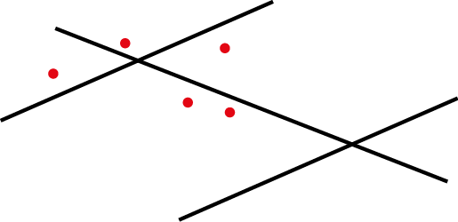

```{r setup, include = FALSE}
knitr::opts_chunk$set(
  collapse = TRUE,
  comment = "#>"
)
```

This vignette is a short introduction to the **NKDE** feature of the **spNetwork** package.


# Quick introduction to NKDE

A classical Kernel Density Estimate (KDE) estimates the continuous density of a set of events in a two-dimensional space. The density is estimated at sampling points, traditionally the centres of pixels dividing into equal zones the study area.

This approach is not adapted to analyze density of events occurring on a network, like accidents and crimes in streets, or leaks on a network of water pipes. Indeed, calculating density values for locations outside the network is meaningless and the Euclidean distance underestimates the real distance between two objects on the network. Moreover, networks are not isotropic spaces. In other words, it is not possible to move in every direction, but only along the edges of the network.

To calculate a Network Kernel Density Estimate (NKDE), it is possible to:

* use lixels instead of pixels. A lixel is a linear equivalent of a pixel on a network. The lines of the network are split into lixels according to a chosen resolution. The centres of the lixels are sampling points for which the density will be estimated.
* calculate network distances between objects instead of Euclidean distances.
* adjust the kernel function to deal with the anisotropic space

A picture is worth a thousand of words, so let us consider this situation: 
<center>
{width=300px}
</center>

Each red point is an event and the lines constitute the network. One could calculate a simple KDE on that dataset and would obtain something like this:

<center>
{width=300px}
</center>

But this is only partially satisfying if we are interested in the density of the events on the network.

To perform a NKDE, the events must be snapped on the network. The snapped events are shown here in green.

<center>
{width=300px}
</center>

The mass of each event can be seen as a third dimension and is evaluated by a selected kernel function (*K*) within a specified bandwidth. The kernel function must satisfy the following conditions:

$K(x) >= 0 \text{, if } x < bandwidth$

$K(x) = 0 \text{, if } x > bandwidth$

$\int K(x)= 1$

The total mass of an event is 1, and is spread according to the function *K* within the bandwidth distance.

For an easier representation, let us consider here the triangle kernel function.

<center>
{width=300px}
</center>

We can see that the "influence" of each point is limited within the bandwidth and decreases when we move away from the event.

With this method, one can evaluate the density of the studied phenomenon at each location on the network. In the next figure, 3 sampling points (s1, s2 and s3) are added in blue.

<center>
{width=300px}
</center>

$$d_{s1} = \frac{1}{bw^2}K(dist_{s1;e1})$$
$$d_{s2} = \frac{1}{bw^2}K(dist_{s2;e2})$$
$$d_{s3} = \frac{1}{bw^2}(K(dist_{s3;e2}) + K(dist_{s3;e3}))$$

And in a more general fashion: 
$d_{si} = \frac{1}{bw^2} \sum_{j=1}^{n} K(dist_{si;ej})$
with $d_{si}$ the density estimated at the sample point *si*, *bw* the bandwidth and *ej* an event.

The proposed kernel functions in the **spNetwork** package are:

* gaussian kernel: 
$k(\dfrac{d_{il}}{r})=\dfrac{1}{\sqrt{2\pi}} * \exp(-\dfrac{d_{il}^2}{2r^2})$

* quartic kernel: 
$k(\dfrac{d_{il}}{r})=\dfrac{3}{\pi} * (1-\dfrac{d_{il}^2}{r^2})$

* epanechnikov kernel: 
$k(\dfrac{d_{il}}{r})=\dfrac{3}{4}*(1-\dfrac{d_{il}^2}{r^2})$

* triangle kernel: 
$k(\dfrac{d_{il}}{r})= 1 - |\dfrac{d_{il}}{r}|$

* uniform kernel: 
$k(\dfrac{d_{il}}{r})= |\dfrac{1}{r}|$

* triweight kernel:
$k(\dfrac{d_{il}}{r})= \dfrac{35}{32} * (1-\dfrac{d_{il}}{r}^2)^3$

* tricube kernel:
$k(\dfrac{d_{il}}{r})= \dfrac{70}{81} * (1-|\dfrac{d_{il}}{r}|^3)^3$

* cosine kernel:
$k(\dfrac{d_{il}}{r})= \dfrac{\pi}{4} * (cos(\dfrac{\pi}{2}*\dfrac{d_{il}}{r}))$

with *r* the bandwidth, and $d_{il}$ the distance between an event and the sampling point.

```{r message=FALSE, warning=FALSE}
library(ggplot2)
library(reshape2)
library(kableExtra)
library(spNetwork)

x <- seq(-15.01,15.01,by = 0.01)
df <- data.frame(
  x = x,
  gaussian = gaussian_kernel(x,15),
  epanechnikov = epanechnikov_kernel(x,15),
  quartic = quartic_kernel(x,15),
  triangle = triangle_kernel(x,15),
  tricube = tricube_kernel(x,15),
  triweight = triweight_kernel(x,15),
  cosine = cosine_kernel(x,15),
  uniform = uniform_kernel(x,15))

df2 <- melt(df, id.vars = "x")
names(df2) <- c("x","kernel","y")

ggplot(df2) + 
  geom_line(aes(x=x,y=y,color=kernel),size=1)

```

As one can see, most of the kernels look alike. It is worth mentioning that the gaussian kernel does not integrate to 1 within the bandwidth (specific case of non-compact kernel). In the **spNetwork** package, all kernel values beyond the bandwidth are set to 0. This means that some mass of each event is lost with the gaussian kernel. To limit this effect, one can use the scaled version of the gaussian kernel for wich the bandwidth is divided by 3, limiting greatly the mass loss.

```{r message=FALSE, warning=FALSE}
Funs <- c(gaussian_kernel, gaussian_kernel_scaled,epanechnikov_kernel,
          quartic_kernel,triangle_kernel, uniform_kernel,
          tricube_kernel,triweight_kernel,
          cosine_kernel)
Names <- c("gaussian", "scaled gaussian", "epanechnikov", "quartic",
           "triangle","uniform", "tricube", "triweight", "cosine")
integrals <- sapply(Funs,function(f){
  return(round(integrate(f,upper=15,lower=-15,bw=15)$value,3))
         })
df <- data.frame("kernel"=Names,
                 "integrals" = integrals)

kable(df)

```
However, the fact that the gaussian kernel does not integrate to 1 within the bandwidth can leads to negative values when using the continuous NKDE (presented latter). Thus, we recommend using the quartic kernel instead.

```{r message=FALSE, warning=FALSE}
x <- seq(-15.01,15.01,by = 0.01)
df <- data.frame(
  x = x,
  gaussian = gaussian_kernel(x,15),
  gaussian_scaled = gaussian_kernel_scaled(x,15),
  epanechnikov = epanechnikov_kernel(x,15),
  quartic = quartic_kernel(x,15)
  )

df2 <- melt(df, id.vars = "x")
names(df2) <- c("x","kernel","y")

ggplot(df2) + 
  geom_line(aes(x=x,y=y,color=kernel),size=1)
```

# The three versions of NKDE

The **spNetwork** package provides three methods to calculate NKDE. We present them briefly here. For more details, please read the original papers and books cited. 

## Simple method

The first method was proposed by @xie2008kernel. Considering the planar KDE, they defined the NKDE with the following formula:

$d_{si} = \frac{1}{bw}\sum_{j=1}^{n} K(dist_{si;ej})$

with $d_{si}$ the density estimated at sample the point *si*, $dist_{si;ej}$ the network distance between *si* and event *j*, with all distances  $dist_{si;ej} < bw$.


Of course, it uses the network distance instead of the Euclidean distance. This method is appealing because it is intuitive, but it is not statistically satisfying. Note that the divisor of the kernel is not the classical $\frac{1}{bw^2}$, but $\frac{1}{bw}$. This adjustment allows for a simpler interpretation of the density: *"Instead of calculating the density over an area unit, the equation estimates the density over a linear unit"* [@xie2008kernel p.398]

In the next figure, we show in 3D what that kernel looks like. The red point is a simple event, the black lines are the network, and the blue lines are the calculated densities.

<center>
{width=150px}
</center>

As one can see, this NKDE is only determined by the distance between the sampling points and the event. This is a problem because at intersections, the event's mass is multiplied by the number of edges at that intersection. Consequently, this is not a true kernel because it does not integrate to 1 on its domain.

This method remains useful for two reasons: 

* For quick data visualization. With big datasets, it might be useful to use this simple method to do a primary investigation.
* In a purely geographical view, this method is intuitive. In the case of crime analysis for example, one could argue that the *strength* of an event should not be affected by intersections on the network. In that case, the kernel function is seen as a distance decaying function.

**What to retain about the simple method ?**

|   Pros              |           Cons             |
|:-------------------:|:--------------------------:|
|quick to calculate   | biased (not a true kernel) |
|intuitive            | overestimate the densities |
|continuous           |                            |


## Discontinuous NKDE

@okabe2012spatial have criticized the previous method, arguing that the produced density estimator  is biased, conducting to overestimation of density. To overcome this limit, they presented two heuristic techniques: the discontinuous and the continuous NKDE.

The discontinuous NKDE is easily presented by a figure: 

<center>
{width=300px}
</center>

The density of the kernel function is equally divided at intersections. Note that *spNetwork* implements the modified version proposed by @sugihara2010simple, allowing for use in networks with cycles. In the case of a cycle, the multiple overlapping values of the kernel are added, as shown in the next figure.

<center>
{width=300px}
</center>

With the case presented before, we obtain the following result.

<center>
{width=150px}
</center>

As one can see, the values of the NKDE are split at intersections to avoid the multiplication of the mass observed in the simple version. However, this creates a discontinuous NKDE, which is counter-intuitive. It leads to sharp differences between density values in the network, and could be problematic in networks with many intersections.

**What to retain about the discontinuous method ?**

|   Pros              |           Cons             |
|:-------------------:|:--------------------------:|
|quick to calculate   | counter-intuitive         |
|unbiased             | discontinuous              |
|                     |   contrasted results       |


## Continuous NKDE

If the previous method is an ubiased estimator and quite easy to calculate, its discontinuous nature might be counter-intuitive in comparison with the simple method. The continuous NKDE merges the best of the two worlds: it adjusts the values of the NKDE at intersections to ensure that it integrates to 1 on its domain, and applies a backward correction to force the density values to be continuous. This process is accomplished by a recursive function, described in the book *Spatial Analysis Along Networks* [@okabe2012spatial]. This function is more time consuming, so it might be necessary to stop it when the recursion is too deep. Considering that the kernel density is divided at each intersection, stopping the function at deep level 16 should give results almost identical to the true values.


<center>
{width=300px}
</center>

There are three different equations to calculate the kernel density depending on the situation (here, q1, q2, q3).

Again, with the case presented before, we obtain the following result.

<center>
{width=150px}
</center>

As one can see, the values of the NKDE are continuous, and the density values close to the events have been adjusted. This leads to smoother results than the discontinuous method.

**What to retain about the discontinuous method**

|   Pros              |           Cons             |
|:-------------------:|:--------------------------:|
| unbiased            | long calculation time      |
| continuous          | smoother values            |


# NKDE in spNetwork

The **spNetwork** package makes this type of analysis straightforward in R. The main problem of the implementation of the NKDE is to reduce computation time. Indeed, for a large dataset, building the network and evaluating the distances between each event and each sampling point would be too long and could lead to memory issues.

To avoid this, the first solution provided in **spNetwork** is a gridded application of the NKDE. The user can split the study area with a grid, the calculation is then performed in each cell of the grid. A buffer is applied on each cell to avoid frontier effect. This behaviour is controlled by the parameter `grid_shape`, indicating the shape of the grid. To split the study area in four rectangles, one can use `grid_shape = c(2,2)`. For a reasonable dataset, it is also possible not to split the study area with `grid_shape = c(1,1)`.

```{r message=FALSE, warning=FALSE}
# first load data and packages
library(sp)
library(maptools)
library(rgeos)
library(spNetwork)
library(raster)
data(mtl_network)
data(bike_accidents)

# then plotting the data
plot(mtl_network)
plot(bike_accidents,add=T,col='red',pch = 19)

# then calculating some lixels to use as sampling points
lixels <- lixelize_lines(mtl_network,200,mindist = 50)
samples <- lines_center(lixels)

# then applying the NKDE
densities <- nkde(mtl_network, 
                  events = bike_accidents,
                  w = rep(1,nrow(bike_accidents)),
                  samples = samples,
                  kernel_name = "quartic",
                  bw = 300, div= "bw", 
                  method = "discontinuous", digits = 1, tol = 1,
                  grid_shape = c(1,1), max_depth = 16,
                  agg = 5, #we aggregate events within a 5m radius (faster calculation)
                  sparse = FALSE, #we use regular matrices (faster calculation)
                  verbose=FALSE)


samples$density <- densities
```

We can now map the density values estimated for each lixel centre:

```{r message=FALSE, warning=FALSE}
library(ggplot2)
library(dplyr)
library(RColorBrewer)
library(classInt)

# rescaling to help the mapping
samples$density <- samples$density*1000

# using a discretization method
breaks <- classIntervals(samples$density, n = 7, style = "jenks", intervalClosure = "right")

colorRamp <- brewer.pal(n = 7, name = "Spectral")
colorRamp <- rev(colorRamp)

samples$class <- as.character(cut(samples$density,breaks$brks,colorRamp,include.lowest =TRUE))

xy <- coordinates(samples)
samples$x <- xy[,1]
samples$y <- xy[,2]

# and finally map with ggplot
labels <- names(print(breaks))
mtl_network$line_id <- 1:nrow(mtl_network)
Mapnetwork <- fortify(mtl_network,id="line_id")

df <- samples@data[order(samples@data$density),]

ggplot() + 
  geom_path(data = Mapnetwork, mapping = aes(x=long,y=lat,group=group), color="black")+
  geom_point(data = df, mapping = aes(x=x,y=y,color=class))+
  scale_color_manual("density",
    breaks = colorRamp, values = colorRamp, 
    label = labels)+
  theme(axis.title.x=element_blank(),
        axis.text.x=element_blank(),
        axis.ticks.x=element_blank(),
        axis.title.y=element_blank(),
        axis.text.y=element_blank(),
        axis.ticks.y=element_blank()) +
  coord_fixed()+
  labs(title = "bike accident density by kilometres in 2016",
          subtitle = "within a radius of 300 metres",
          caption = "using the quartic kernel")
  

```

As you can imagine it remains a costly process, especially for the continuous kernel that is calculated with a recursive function. The package **spNetwork** uses three approaches simultaneously to reduce calculation time: 

* Rcpp: the main functions are coded with C++
* Armadillo: the linear algebra is performed with the RcppArmadillo package
* multiprocessing: it is possible to split the calculation on multiple cores

The calculus of the NKDE for each cell could be done by several cores. To do so, **spNetwork** provides a function *nkde.mc*. More specifically, it uses functions from the packages **future** and **future.apply**. The selection of the plan has to be done by the user to ensure the best compatibility on each os and computer. See the documentation of the **future** package if needed.

Note that the combined use of **Rcpp** and **future** is difficult. **Rcpp** functions can not be sent to child processes. To overcome this, a separate package **spNetworkCpp** exists on its own and contains only the **Rcpp** functions. This separate package is installed with **spNetwork**. **spNetworkCpp** is then loaded by each child processes.

The following code will produce the same results as before but split the work between two cores. Note that the plan used by the package **future** may vary according to your os.
```{r message=FALSE, warning=FALSE}

# setting the multisession plan
future::plan(future::multisession(workers=2))

# then applying the NKDE
densities_mc <- nkde.mc(mtl_network, 
                  events = bike_accidents,
                  w = rep(1,nrow(bike_accidents)),
                  samples = samples,
                  kernel_name = "quartic",
                  bw = 300, div= "bw", 
                  method = "discontinuous", digits = 1, tol = 1,
                  grid_shape = c(2,2),
                  max_depth = 16, # splitting the study area in 4 rectangles
                  agg = 5, #we aggregate events within a 5m radius
                  sparse = FALSE, #we use regular matrices for speed
                  verbose=FALSE)

# let's set back the classical sequential plan
if (!inherits(future::plan(), "sequential")) future::plan(future::sequential)

# we can compare the previous result and the new one
diff <- sum(abs(densities - densities_mc))
print(paste("overall difference between the regular and paralellized method : ",round(diff,12),sep=""))

```

# An example with adaptive bandwidth

The examples provided in the previous sections are using only a fixed bandwidth. If we relax the need for a fixed bandwidth, we obtain an adaptive estimator. In other words, the bandwidth vary in the study area. **spNetwork** uses the method proposed by @abramson1982bandwidth, implying a variation of the bandwidth that is inversely proportional to the square root of the target density itself. In other words, at places where the density of the spatial process is high, the bandwidth of the kernel will be smaller and inversely. The use of an adaptive bandwidth has many theoretical and practical advantages. First, it reduces the sensibility to outliers. Second, it reduces smoothing in sub-region with many events (giving more detailed density estimation) and increases the smoothing in sub-region with few events (giving fuzzier results because of the higher uncertainty).

The problem is that the true density itself is unknown (otherwise we would not have to estimate it with a smoothing method). To obtain the adaptive bandwidth, a three steps method is used : 

1. A fixed reference bandwidth ($h_{0}$) is selected. For each event ($e_{i}$) on the network, the density of the spatial process is evaluated by using this reference bandwidth ($\tilde{f}h_{0}(e_{i})$).
2. For each event, the adaptive bandwidth is calculated with the following formula. A trimming values can be defined to limit the maximum adaptive bandwidth.
3. The densities at sampling points are then evaluated by using the obtained vector of bandwidth for each event.

$$
h(e_{i}) = h_{0} * \frac{1}{\sqrt{\tilde{f}h_{0}(e_{i})}} * \frac{1}{\gamma_{f}}\\
\gamma_{f} = \exp(\frac{\sum_{i}log(\frac{1}{\sqrt{\tilde{f}h_{0}(e_{i})}})}{n})
$$

This method is called event oriented, because the new bandwidths are evaluated for the events rather than the sampling points. The sample oriented method is not implemented because not compatible with the algorithms used to calculate the discontinuous and continuous NKDE.

In **spNetwork**, when an adaptive bandwidth is used, the calculated bandwidth for each event is returned too.

Let us calculate a new NKDE, but with an adaptive bandwidth.
```{r message=FALSE, warning=FALSE}

adapt_densities <- nkde(mtl_network, 
                  events = bike_accidents,
                  w = rep(1,nrow(bike_accidents)),
                  samples = samples,
                  kernel_name = "quartic",
                  bw = 300, div= "bw", 
                  adaptive = TRUE, # we use here an adaptive bandwidth
                  trim_bw = 600, # the maximum local values of bandwidth will be 600m
                  method = "discontinuous", digits = 1, tol = 1,
                  grid_shape = c(1,1), max_depth = 16,
                  agg = 5, #we aggregate events within a 5m radius (faster calculation)
                  sparse = TRUE, #we use regular matrices (faster calculation)
                  verbose=FALSE)

samples$density <- adapt_densities$k

```

We can now map some of the bandwidths
```{r message=FALSE, warning=FALSE, eval = FALSE}
circles <- gBuffer(adapt_densities$events,byid = TRUE,width = adapt_densities$events$bw)

ids <- c(1,52,20,86,14,75,126,200,177)

plot(mtl_network)
plot(bike_accidents,add=T,col='red',pch = 19,cex=0.5)
plot(circles[ids,],add=T,border='blue',lwd=2)
```

And map the new densities with the same code as previous

```{r echo=FALSE, message=FALSE, warning=FALSE, eval = FALSE}
# rescaling to help the mapping
samples$density <- samples$density*1000

# using a discretization method
breaks <- classIntervals(samples$density, n = 7, style = "jenks", intervalClosure = "right")

colorRamp <- brewer.pal(n = 7, name = "Spectral")
colorRamp <- rev(colorRamp)

samples$class <- as.character(cut(samples$density,breaks$brks,colorRamp,include.lowest =TRUE))

xy <- coordinates(samples)
samples$x <- xy[,1]
samples$y <- xy[,2]

# and finally map with ggplot
labels <- names(print(breaks))
mtl_network$line_id <- 1:nrow(mtl_network)
Mapnetwork <- fortify(mtl_network,id="line_id")

df <- samples@data[order(samples@data$density),]

ggplot() + 
  geom_path(data = Mapnetwork, mapping = aes(x=long,y=lat,group=group), color="black")+
  geom_point(data = df, mapping = aes(x=x,y=y,color=class))+
  scale_color_manual("density",
    breaks = colorRamp, values = colorRamp, 
    label = labels)+
  theme(axis.title.x=element_blank(),
        axis.text.x=element_blank(),
        axis.ticks.x=element_blank(),
        axis.title.y=element_blank(),
        axis.text.y=element_blank(),
        axis.ticks.y=element_blank()) +
  coord_fixed()+
  labs(title = "bike accident density by kilometres in 2016",
          subtitle = "within a radius of 300 metres (adaptive bandiwdth)",
          caption = "using the quartic kernel")
  

```


## Applying a correction factor to avoid edge effects

When the study area is limited, the kernel density estimate is biased at the border because the events at the other side of the border are not sampled. To mitigate the induced bias, one could apply the Diggle correction factor.

$$d(u) = \sum_{i=1}^{n}\frac{1}{e(x_{i})}K(dist(u-x_{i}))\\e(u) = \int_{W}{K(dist(u,v))}$$
The correction factor $e(u)$ is calculated for each event for which a part of its mass is outside the study area. More precisely, $e(x_{i})$ is the percentage of the mass of the event $x_i$ located inside the study area. The kernel function could be the simple, the continuous or the discontinuous. This correction factor can be used with the adaptive bandwidth too. Note that this correction is usable only if the network outside the study_area is available.

Let us illustrate it here by using a sub part of the same data

```{r message=FALSE, warning=FALSE}

# selecting the events in a subset of the data
center_event <- bike_accidents[125,]
study_area <- rgeos::gBuffer(center_event,width = 800)
events_sel <- as.vector(rgeos::gIntersects(bike_accidents, study_area,byid=TRUE))
events <- subset(bike_accidents,events_sel)

# generating the sampling points
lines_sel <- as.vector(rgeos::gIntersects(mtl_network, study_area,byid=TRUE))
lines <- subset(mtl_network,lines_sel)

invisible(capture.output(lixels <- lixelize_lines(mtl_network,100,mindist = 50)))
invisible(capture.output(samples <- lines_center(lixels)))


sp::plot(study_area,col="white")
sp::plot(mtl_network,add=TRUE)
sp::plot(events,add=TRUE, col="red")

# calculating the NKDE values, adjusted
adjusted_densities <- nkde(lines = mtl_network,
                            events = events,
                            w = rep(1,nrow(events)),
                            samples = samples,
                            kernel_name = "quartic",
                            bw = 150,
                            adaptive = FALSE,
                            method = "discontinuous",
                            div = "bw",
                            diggle_correction = TRUE, study_area = study_area,
                            max_depth = 15,
                            digits = 2,tol = 0.1,agg = 5,sparse = TRUE,
                            grid_shape = c(1,1),verbose = FALSE)

samples$density <- adjusted_densities
```

And again, we can map the results.

```{r echo=FALSE, message=FALSE, warning=FALSE}
extent <- sp::bbox(study_area)

# rescaling to help the mapping
samples$density <- samples$density*1000

# using a discretization method
breaks <- classIntervals(samples$density, n = 7, style = "jenks", intervalClosure = "right")

colorRamp <- brewer.pal(n = 7, name = "Spectral")
colorRamp <- rev(colorRamp)

samples$class <- as.character(cut(samples$density,breaks$brks,colorRamp,include.lowest =TRUE))

xy <- coordinates(samples)
samples$x <- xy[,1]
samples$y <- xy[,2]

# and finally map with ggplot
labels <- names(print(breaks))
mtl_network$line_id <- 1:nrow(mtl_network)
Mapnetwork <- fortify(mtl_network,id="line_id")

df <- samples@data[order(samples@data$density),]

ggplot() + 
  geom_path(data = Mapnetwork, mapping = aes(x=long,y=lat,group=group), color="black")+
  geom_point(data = df, mapping = aes(x=x,y=y,color=class))+
  scale_color_manual("density",
    breaks = colorRamp, values = colorRamp, 
    label = labels)+
  theme(axis.title.x=element_blank(),
        axis.text.x=element_blank(),
        axis.ticks.x=element_blank(),
        axis.title.y=element_blank(),
        axis.text.y=element_blank(),
        axis.ticks.y=element_blank()) +
  coord_fixed()+
  xlim(extent[1,])+
  ylim(extent[2,])+
  labs(title = "bike accident density by kilometres in 2016",
          subtitle = "within a radius of 100 metres")

```

## Complementary functions

To define the sampling points on the network, some complementary functions are provided: 

* `lines_center` returns the center point of each line in a *SpatialLinesDataFrame*.
* `lixelize_lines` returns lixels obtained after dividing a *SpatialLinesDataFrame*.
* `lines_points_along` returns points at a specified distance along each lines in a *SpatialLinesDataFrame*.


# References
