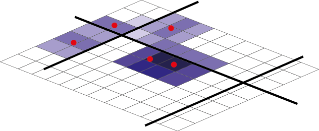

```{r setup, include = FALSE}
knitr::opts_chunk$set(
  collapse = TRUE,
  comment = "#>"
)
```


This vignette is a short introduction to the **NKDE** feature of the **spNetwork** package by using datasets provided with the package.


# Quick introduction to NKDE

A classical Kernel Density Estimate (KDE) estimates the continuous density of a set of events in a two-dimensional space. The density is estimated at sampling points, traditionally the centres of pixels dividing in equal zones the study area.

This approach is not adapted to analyze density of events occurring on a network, like accidents and crimes in streets, or leaks on a network of water pipes. Indeed, calculating density values for locations outside the network is meaningless and the Euclidean distance underestimates the real distance between two objects on the network. Moreover, networks are not isotropic spaces, in other words, it is not possible to move in every direction, but only on the edges of the network.

To perform a Network Kernel Density Estimate (NKDE), it is possible to:

* using lixels instead of pixels. A lixel is a linear equivalent of a pixel on a network. The lines of the network are split into lixels according to a chosen resolution. The centres of the lixels are sampling points for which the density will be estimated.
* calculating reticular distances between objects instead of euclidean distances.
* adjusting the kernel function to deal with the anisotropic space

An image is worth 1000 words, so let us consider this situation : 
<center>
{width=300px}
</center>

Each red point is an event and the lines constitute the network. One could realize a simple KDE on that dataset and would obtain something like :

<center>
{width=300px}
</center>

But this is only partially satisfying if we are interested in the density of the events on the network.

To perform a NKDE, the events must be snapped on the network. The snapped events are shown here in green.

<center>
{width=300px}
</center>

The density of each event can be seen as a third dimension and is evaluated by a selected kernel function (*K*) within a specified bandwidth. The kernel function must satisfy the following conditions :

$K(x) >= 0 \text{, if } x < bandwidth$

$K(x) = 0 \text{, if } x > bandwidth$

$\int K(x)dx= 1$

The total mass of an event is 1, and spread according to the function *K* within the bandwidth distance.

For an easier representation, let us consider here the triangle kernel function.

<center>
{width=300px}
</center>

We can see that the "influence" of each point is limited within the bandwidth and decreases when we are farther from the event.

With this method, one can evaluate the density of the studied phenomenom at each point of the network. In the next figure, 3 sampling points (s1, s2 and s3) are added in blue.

<center>
{width=300px}
</center>

$$d_{s1} = K(dist_{s1;e1})$$
$$d_{s2} = K(dist_{s2;e2})$$
$$d_{s3} = (1/2) * (K(dist_{s3;e2}) + K(dist_{s3;e3}))$$

And in a more general fashion: 
$d_{si} = (1/n) * \sum_{j=1}^{n} K(dist_{si;ej})$
with *n* the number of events within the bandwidth arround the sampling point *si*


The proposed kernel function in the **spNetwork** package are :

* the gaussian kernel : 
$k(\dfrac{d_{il}}{r})=\dfrac{1}{\sqrt{2\pi}} * \exp(-\dfrac{d_{il}^2}{2r^2})$

* the quartic kernel : 
$k(\dfrac{d_{il}}{r})=\dfrac{3}{\pi} * (1-\dfrac{d_{il}^2}{r^2})$

* the epanechnikov kernel : 
$k(\dfrac{d_{il}}{r})=\dfrac{3}{4}*(1-\dfrac{d_{il}^2}{r^2})$

* the triangle kernel : 
$k(\dfrac{d_{il}}{r})= 1 - |\dfrac{d_{il}}{r}|$

* the triweight kernel
$k(\dfrac{d_{il}}{r})= \dfrac{35}{32} * (1-\dfrac{d_{il}}{r}^2)^3$

* the tricube kernel
$k(\dfrac{d_{il}}{r})= \dfrac{70}{81} * (1-|\dfrac{d_{il}}{r}|^3)^3$

* the cosine kernel
$k(\dfrac{d_{il}}{r})= \dfrac{\pi}{4} * (cos(\dfrac{\pi}{2}*\dfrac{d_{il}}{r}))$


```{r message=FALSE, warning=FALSE}
library(ggplot2)
library(reshape2)
library(kableExtra)
library(spNetwork)

x <- seq(-15,15,by = 0.01)
df <- data.frame(
  x = x,
  gauss = gaussian_kernel(x,15),
  epanechnikov = epanechnikov_kernel(x,15),
  quartic = quartic_kernel(x,15),
  triangle = triangle_kernel(x,15),
  tricube = tricube_kernel(x,15),
  triweight = triweight_kernel(x,15),
  cosine = cosine_kernel(x,15))

df2 <- melt(df, id.vars = "x")
names(df2) <- c("x","kernel","y")

ggplot(df2) + 
  geom_line(aes(x=x,y=y,color=kernel))

```


As one can see, most of the kernels look alike. It is worth mentioning that the gaussian kernel does not integrate to 1. This means that some weight of each event is lost with the gaussian kernel.

```{r message=FALSE, warning=FALSE}
Funs <- c(gaussian_kernel,epanechnikov_kernel,
          quartic_kernel,triangle_kernel,
          tricube_kernel,triweight_kernel,
          cosine_kernel)
Names <- c("gaussian", "epanechnikov", "quartic",
           "triangle", "tricube", "triweight", "cosine")
integrals <- sapply(Funs,function(f){
  return(round(integrate(f,upper=15,lower=-15,bw=15)$value,3))
         })
df <- data.frame("kernel"=Names,
                 "integrals" = integrals)

kable(df)

```

# The three versions of NKDE

The **spNetwork** package provides three methods to perform NKDE. We present them brievely here. For more details, please read the original papers and books cited. One could also look at the vignette *Details about NKDE* to find a complementary description of each method.

## The simple method

The first method was proposed by @xie2008kernel. Considering the planer KDE, they defined the NKDE with the following formula :

$d_{si} = (1/bandwidth) * \sum_{j=1}^{n} K(dist_{si;ej})$


Of course, it uses the network distance instead of the euclidean distance. This method is appealing because it is intuitive, but is not statistically satisfying. Note that the divisor of the kernel is not the classical 1/n, but 1/bandwidth. This adjustment allows a simpler interpretation of the density:

*"Instead of calculating the density over an area unit, the equation estimates the density over a linear unit"*

## The discontinuous NKDE

@okabe2012spatial have critized the previous method, arguing that the produced density estimator  is biased, conducting to overestimation of density. More specifically, the simple method does not conserve mass and the proposed kernel is not a probability density along the network. To overcome this limit, they presented two heuristic techniques: the discontinuous and the continuous NKDE.

The discontinuous NKDE is easily presented by a figure : 

<center>
{width=300px}
</center>

The density of the kernel function is equally divided at intersections. Note that *spNetwork* implements the modified version proposed by @sugihara2010simple, allowing for use in networks with cycles. In the case of a cycle, the multiple values of the kernel that overlap are added.


#### the continuous NKDE

If the previous method is an ubaised estimator and quite easy to calculate, its discontinuous nature might be counter-intuitive. The continuous NKDE solves this problem.

<center>
{width=300px}
</center>

There are three different equations to calculate the kernel density depending on the situation (here, q1, q2, q3). One can note that intersections will affect kernel values on the edges before the intersection. This behaviour is desribed in [@okabe2012spatial; @okabe2009kernel] as a recursive function, and implemented in the same way in **spNetwork**.

The continuous version of the NKDE produces smoother results than the discontinuous version.

# NKDE in spNetwork

The **spNetwork** package makes this type of analysis straightforward in R. The main problem of the implementation of the NKDE is to reduce computation time. Indeed, for a large dataset, building the network and evaluating the distances between each event and each sampling point would be too long and could lead to memory issues.

To avoid this, the first solution provided in **spNetwork** is a gridded application of the NKDE. The user can split the study area with a grid, the calculation is then performed in each cell of the grid. A buffer is applied on each cell to avoid frontier effect. This behaviour is controled by the parameter *grid_shape*, indicating the shape of the grid. To split the study area in four rectangles, one can use *grid_shape = c(2,2)*. For a reasonable dataset, it is also possible not to split the study area with *grid_shape = c(1,1)*


```{r message=FALSE, warning=FALSE}
#first load data and packages
library(sp)
library(maptools)
library(rgeos)
library(spNetwork)
library(raster)
data(mtl_network)
data(bike_accidents)

#then plotting the data
plot(mtl_network)
plot(bike_accidents,add=T,col='red',pch = 19)

#then calculating some lixels to use as sampling points
#set to silent here for the vignette output
invisible(capture.output(lixels <- lixelize_lines(mtl_network,200,mindist = 50)))
invisible(capture.output(samples <- lines_center(lixels)))


#then applying the NKDE
densities <- nkde(mtl_network, 
                  events = bike_accidents,
                  w = rep(1,nrow(bike_accidents)),
                  samples = samples,
                  kernel_name = "quartic",
                  bw = 300, div= "bw", 
                  method = "discontinuous", digits = 1, tol = 1,
                  grid_shape = c(1,1),
                  verbose=FALSE)


samples$density <- densities
```

We can then map the density values estimated for each lixel:

```{r message=FALSE, warning=FALSE}
library(ggplot2)
library(dplyr)
library(RColorBrewer)
library(classInt)

#rescaling to help the mapping
samples$density <- samples$density*1000

#using a discretization method
breaks <- classIntervals(samples$density, n = 7, style = "jenks", intervalClosure = "right")

PaletteCouleur <- brewer.pal(n = 7, name = "Spectral")
PaletteCouleur <- rev(PaletteCouleur)

samples$class <- as.character(cut(samples$density,breaks$brks,PaletteCouleur,include.lowest =TRUE))

xy <- coordinates(samples)
samples$x <- xy[,1]
samples$y <- xy[,2]

#and finally map with ggplot
labels <- names(print(breaks))
mtl_network$line_id <- 1:nrow(mtl_network)
Mapnetwork <- fortify(mtl_network,id="line_id")

ggplot() + 
  geom_path(data = Mapnetwork, mapping = aes(x=long,y=lat,group=group), color="black")+
  geom_point(data = samples@data, mapping = aes(x=x,y=y,color=class))+
  scale_color_manual("density",
    breaks = PaletteCouleur, values = PaletteCouleur, 
    label = labels)+
  theme(axis.title.x=element_blank(),
        axis.text.x=element_blank(),
        axis.ticks.x=element_blank(),
        axis.title.y=element_blank(),
        axis.text.y=element_blank(),
        axis.ticks.y=element_blank()) +
  coord_fixed()+
  ggtitle("bike accident density by kilometers in 2016",
          subtitle = "within a radius of 300 meters")
  

```

As you can imagine it remains a costly process, especially for the continuous kernel that is calculated with a recursive function. The package **spNetwork** uses two approaches to reduce calculation time : 
* Rcpp : the main functions are coded with c++
* multiprocessing : it is possible to split the calculation on multiple cores

The calculus of the NKDE for each cell could be done by several cores. To do so, **spNetwork** provides a function *nkde.mc*. More specifically, it uses functions from the packages **future** and **future.apply**. The selection of the plan is let to the user to permit the best compatibility on each os and computer. One could even paralellize this calculation on several computers. See the documentation of the **future** package if needed.

Note that the combined use of **Rcpp** and **future** is difficult. **Rcpp** functions can not be sent to child processes. To overcome this, a separate package **spNetworkCpp** exists on its own and contains only the **Rcpp** functions. **spNetworkCpp** is then loaded by each child processes.

Let us split the work between 4 cores.
```{r}

#setting the multiprocess plan
future::plan(future::multiprocess(workers=4))

#then applying the NKDE
densities_mc <- nkde.mc(mtl_network, 
                  events = bike_accidents,
                  w = rep(1,nrow(bike_accidents)),
                  samples = samples,
                  kernel_name = "quartic",
                  bw = 300, div= "bw", 
                  method = "discontinuous", digits = 1, tol = 1,
                  grid_shape = c(3,3), # here we split the study area into 9 rectangles
                  verbose=FALSE)

# let's set back the classical sequential plan
if (!inherits(future::plan(), "sequential")) future::plan(future::sequential)

#we can compare the previous result and the new one
diff <- sum(abs(densities - densities_mc))
print(paste("overall difference between the regular and paralellized method : ",round(diff,12),sep=""))

```


## complementary functions

To define the sampling points on the network, some complementary functions are provided : 

* **lines_center**, return the center point of each line in a SpatialLinesDataFrame
* **lixelize_lines***, return lixels obtained after dividing a SpatialLinesDataFrame
* **lines_points_along**, return points at a specified distance along each lines in a SpatialLinesDataFrame


# References
