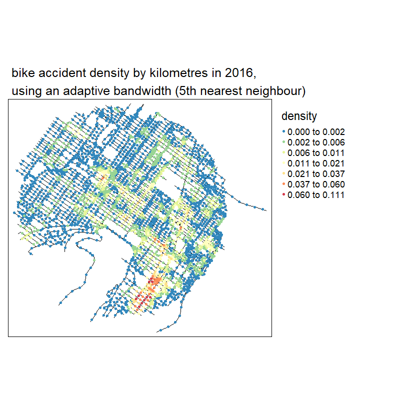
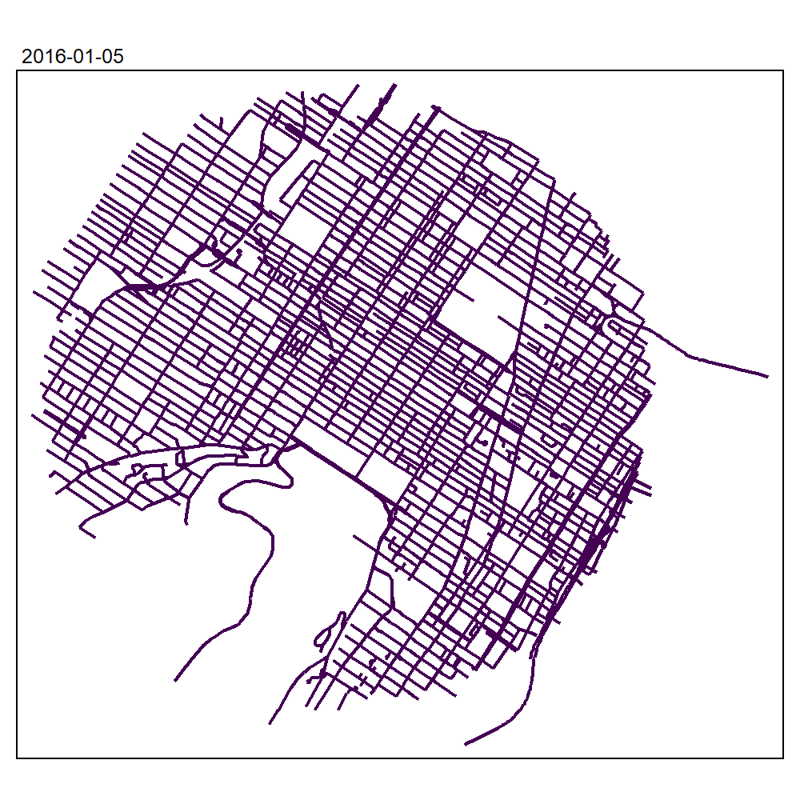

```{r setup, include = FALSE}
knitr::opts_chunk$set(
  collapse = TRUE,
  comment = "#>"
)
backup_option <- options()
base_wd <- getwd()
library(ggplot2)
```

# Introduction

As stated in the vignette  (*Network Kernel Density Estimate*), it is possible to use adaptive bandwidths instead of a fixed bandwidth to adapt the level of smoothing of the NKDE locally. The default approach is to use the method proposed by @abramson1982bandwidth, implying a variation of the bandwidth that is inversely proportional to the square root of the target density itself. However, one can also specified the bandwidths to use for each event directly and thus try other approaches. We give in this vignette some examples.

# K nearest neighbours adaptive bandwidth for NKDE

For each event, the K nearest neighbour distance could be used as a locally adapted bandwidth for intensity estimation. This method is called the k-nearest neighbour kernel density estimation method [@loftsgaarden_nonparametric_1965;@terrell_variable_1992;@orava_k-nearest_2011].

To apply it in `spNetwork`, one can use the `network_knn` function. The first step is to load the required packages and data.

```{r message=FALSE, warning=FALSE}
# first load data and packages
library(sf)
library(spNetwork)
library(tmap)
library(ggplot2)
library(RColorBrewer)
library(classInt)
library(viridis)

data(mtl_network)
data(bike_accidents)
```

We must then aggregate the events that are very close.

```{r message=FALSE, warning=FALSE}
bike_accidents$weight <- 1
bike_accidents_agg <- aggregate_points(bike_accidents, 15, weight = "weight")
```

We can now calculate for each event its distance to its 30th neighbour.

```{r message=FALSE, warning=FALSE, out.width = "60%", fig.align= "center"}
knn_dists <- network_knn(origins = bike_accidents_agg, 
                         lines = mtl_network, 
                         k = 30,
                         maxdistance = 5000,
                         line_weight = "length",
                         digits = 2, tol = 0.1)

bws <- knn_dists$distances[,20]

ggplot() + 
  geom_histogram(aes(x = bws), fill = "white", color = "black", bins = 50) + 
  labs(x = "distance to 20th neighbour (m)")
```

There is some events for which the 20th neighbour is very far. We decide here to trim the bandwidth at 1500m.

```{r message=FALSE, warning=FALSE}

trimed_bw <- ifelse(bws > 1500, 1500, bws)

lixels <- lixelize_lines(mtl_network,200,mindist = 50)
samples <- lines_center(lixels)

densities <- nkde(lines = mtl_network,
                  events = bike_accidents_agg,
                  w = bike_accidents_agg$weight,
                  samples = samples,
                  kernel_name = "quartic",
                  bw = trimed_bw,
                  div= "bw",
                  adaptive = FALSE,
                  method = "discontinuous",
                  digits = 1,
                  tol = 1,
                  grid_shape = c(1,1),
                  verbose = FALSE,
                  diggle_correction = FALSE,
                  study_area = NULL,
                  max_depth = 10, agg = NULL, sparse = TRUE)
```

We can now map the result
```{r message=FALSE, warning=FALSE, fig.align= "center", fig.width = 8, fig.height = 8}

# rescaling to help the mapping
samples$density <- densities*1000

colorRamp <- brewer.pal(n = 7, name = "Spectral")
colorRamp <- rev(colorRamp)

samples2 <- samples[order(samples$density),]
title <- paste0("bike accident density by kilometres in 2016,",
                "\nusing an adaptive bandwidth (20th nearest neighbour)")

tm_shape(mtl_network) + 
  tm_lines("black") + 
  tm_shape(samples2) + 
  tm_dots("density", style = "kmeans", palette = colorRamp, n = 7, size = 0.1) + 
  tm_layout(legend.outside = TRUE, 
            main.title = title, main.title.size = 1)

```

It is easy to calculate the density for several distances and comparing the results with maps.

```{r message=FALSE, warning=FALSE, fig.align= "center", fig.width = 10, fig.height = 20}

# calculating all the densities
all_densities <- lapply(c(5,10,15,20,25,30), function(i){
  bws <- knn_dists$distances[,i]
  upper_trim <- quantile(bws, probs = 0.95)
  trimed_bws <- ifelse(bws > upper_trim, upper_trim, bws)
  densities <- nkde(lines = mtl_network,
                  events = bike_accidents_agg,
                  w = bike_accidents_agg$weight,
                  samples = samples,
                  kernel_name = "quartic",
                  bw = trimed_bws,
                  div= "bw",
                  adaptive = FALSE,
                  method = "discontinuous",
                  digits = 1,
                  tol = 1,
                  grid_shape = c(1,1),
                  verbose = FALSE,
                  diggle_correction = FALSE,
                  study_area = NULL,
                  max_depth = 10, agg = NULL, sparse = TRUE)
  
  return(list("dens" = densities,
              "knn" = i))
})

## calculating a shared discretization
#all_values <- c(sapply(all_densities, function(x){x$dens}))
#color_breaks <- classIntervals(all_values * 1000, n = 7, style = "kmeans")

# producing all the maps
all_maps <- lapply(all_densities, function(element){
  
  densities <- element$dens
  samples$density <- densities*1000
  
  samples2 <- samples[order(samples$density),]
  title <- paste0("bike accident density by kilometres in 2016,",
                  "\nusing an adaptive bandwidth (",element$knn,"th nearest neighbour)")
  
  knnmap <- tm_shape(mtl_network) + 
    tm_lines("black") + 
    tm_shape(samples2) + 
    #tm_dots("density", breaks = color_breaks$brks, palette = viridis(7), size = 0.05) +
    tm_dots("density", n = 7, style = "kmeans", palette = colorRamp , size = 0.05) +
    tm_layout(legend.outside = TRUE, 
              main.title = title, main.title.size = 1) 
  return(knnmap)
})

tmap_animation(all_maps, filename = "images/animated_densities.gif",
               width = 800, height = 800, dpi = 150, delay = 200, loop = TRUE)

```

```{r message=FALSE, warning=FALSE, fig.align= "center", out.width = "100%"}

```
With no suprise, the larger the bandwidth, the smoother the results

## Finding the optimal bandwidth

To complete the visual inspection we did above, we could select an optimal set of local bandwidths by using the likelihood cross validation criterion.
To do so, we can use the function `bw_cv_likelihood_calc` and we must create a matrix of bandwidths that will be evaluated.

We will compare below the scores obtained for the local bandwidths based on the 5th to 25th nearest neighbours.
```{r message=FALSE, warning=FALSE}

nearest_nb_mat <- knn_dists$distances[,5:25]
colnames(nearest_nb_mat) <- 5:25

bw_scores <- bw_cv_likelihood_calc(lines = mtl_network,
                                   events = bike_accidents_agg,
                                   w = bike_accidents_agg$weight,
                                   kernel_name = 'quartic',
                                   method = 'discontinuous',
                                   adaptive = TRUE,
                                   mat_bws = nearest_nb_mat,
                                   digits = 1,
                                   tol = 0.01, 
                                   max_depth = 10, agg = NULL, sparse = TRUE)

df <- data.frame(
  k = 5:25,
  score = bw_scores[,2]
)
ggplot(df) + 
  geom_line(aes(x = k, y = score)) + 
  geom_point(aes(x = k, y = score), color = 'red') + 
  theme_bw()

```

Based on these results, we decide to use the 8th nearest neighbour as an optimal bandwidth. It clearly minimizes the likelihood cross validation criterion.

# K nearest neighbours adaptive bandwidth for TNKDE

This method can be extended to the spatio-temporal case. We propose here a two-steps approach: 

1. Finding for each event its 20 nearest neighbours on the network. The distance to the last neighbour will be the local network bandwidth for this event.
2. Within the selected neighbours, calculating the median of the temporal distances with the event. This value will be used as the local time bandwidth for this event.

This approach ensures that relatively small network bandwidths are selected, and limits the risk of obtaining very wide temporal bandwidths. It is well adapted if the events are characterized by strong spatio-temporal autocorrelation.

```{r message=FALSE, warning=FALSE, out.width = "60%", fig.align= "center"}

# creating a time variable
bike_accidents$time <- as.POSIXct(bike_accidents$Date, format = "%Y/%m/%d")

# associating each original event with its new location
bike_accidents$locID <- dbscan::kNN(st_coordinates(bike_accidents_agg),
            k = 1, query = st_coordinates(bike_accidents))$id[,1]

# matrix of all reached agg events
ids_mat <- knn_dists$id

# finding for each event its temporal distance to its neighbours
bike_accidents_table <- st_drop_geometry(bike_accidents)

temporal_mat <- sapply(1:nrow(bike_accidents_table), function(i){
  loc_ids <- ids_mat[bike_accidents_table[i,"locID"],]
  events <- subset(bike_accidents_table, bike_accidents_table$locID %in% loc_ids)
  dists <- abs(as.numeric(difftime(bike_accidents_table[i,"time"], events$time, units = "days")))
  return(dists)
})

# calculating the medians
medians <- sapply(temporal_mat,median)
ggplot() + 
  geom_histogram(aes(x = medians), bins = 30, color = "white")
```

Once again, we could trim the obtained bandwidths and setting a limit at 120 days (4 months).

```{r message=FALSE, warning=FALSE, out.width = "60%", fig.align= "center"}
trimed_bws_time <- ifelse(medians > 120, 120, medians)
```

And we can now calculate the TNKDE with these bandwidths: 

```{r message=FALSE, warning=FALSE}

net_bws <- knn_dists$distance[bike_accidents$locID,20]
trimed_net_bws <- ifelse(net_bws > 1500, 1500, net_bws)

bike_accidents$int_time <- as.integer(difftime(bike_accidents$time, 
                                               min(bike_accidents$time),
                                               units = "days"))

sample_time <- seq(0, max(bike_accidents$int_time), 15)

tnkde_densities <- tnkde(lines = mtl_network,
                  events = bike_accidents,
                  time_field = "int_time",
                  w = rep(1,nrow(bike_accidents)),
                  samples_loc = samples,
                  samples_time = sample_time,
                  kernel_name = "quartic",
                  bw_net = trimed_net_bws,
                  bw_time = trimed_bws_time,
                  div= "bw",
                  adaptive = FALSE,
                  method = "discontinuous",
                  digits = 1,
                  tol = 1,
                  grid_shape = c(1,1),
                  verbose = FALSE,
                  diggle_correction = FALSE,
                  study_area = NULL,
                  max_depth = 10, agg = NULL, sparse = TRUE)
```

We can now create an animated map to display the results: 

```{r message=FALSE, warning=FALSE, eval = FALSE}
# creating a color palette for all the densities
library(classInt)
library(viridis)
all_densities <- c(tnkde_densities)
color_breaks <- classIntervals(all_densities, n = 10, style = "kmeans")

start <- min(bike_accidents$time)

# generating a map at each sample time
all_maps <- lapply(1:ncol(tnkde_densities), function(i){
  time <- sample_time[[i]]
  date <- as.Date(start) + time
  
  lixels$density <- tnkde_densities[,i]
  lixels <- lixels[order(lixels$density), ]
  map1 <- tm_shape(lixels) + 
  tm_lines(col = "density", lwd = 1.5,
          breaks = color_breaks$brks, palette = viridis(10)) + 
    tm_layout(legend.show=FALSE, main.title = as.character(date), main.title.size = 0.5)
  return(map1)
})

# creating a gif with all the maps
tmap_animation(all_maps, filename = "images/animated_map_tnkdeknn.gif", 
               width = 1000, height = 1000, dpi = 300, delay = 50)
```
```{r message=FALSE, warning=FALSE, out.width = "75%", fig.align='center'}

```

## Finding the optimal bandwidth

To find the optimal bandwidth, we can use again the likelihood cross validation criterion. We need to create an array of bandwidths.

The goal here is to find the number of neihgbours *k* which optimizes the likelihood cross validation criterion. So we will have several nework bandwidths, but only one time bandwidth.

The dimensions of this array must be as follow : c(network,temporal,events)

```{r message=FALSE, warning=FALSE}

network_bws <- array(1, dim = c(length(5:25),1,nrow(bike_accidents_table)))
time_bws <- array(1, dim = c(length(5:25),1,nrow(bike_accidents_table)))

# we complete the array with the network bandwidths
for(i in 1:nrow(bike_accidents_table)){
  id <- bike_accidents_table$locID[[i]]
  # we get the local network bandwidths
  net_bws <- knn_dists$distance[id,5:25]
  network_bws[,1,i] <- net_bws
}

# we complete the array with the time bandwidths
ii <- 1
for(j in 5:25){
  temporal_mat <- sapply(1:nrow(bike_accidents_table), function(i){
    loc_ids <- ids_mat[bike_accidents_table[i,"locID"],1:j]
    events <- subset(bike_accidents_table, bike_accidents_table$locID %in% loc_ids)
    dists <- abs(as.numeric(difftime(bike_accidents_table[i,"time"], events$time, units = "days")))
    return(dists)
  })
  medians <- sapply(temporal_mat,median)
  time_bws[ii,1,] <- medians
  ii <- ii + 1
}


values <- bw_tnkde_cv_likelihood_calc(lines = mtl_network,
                                      events = bike_accidents,
                                      time_field = "int_time",
                                      w = rep(1,nrow(bike_accidents)),
                                      kernel_name = 'quartic',
                                      method = 'discontinuous',
                                      arr_bws_net = network_bws,
                                      arr_bws_time = time_bws,
                                      diggle_correction = FALSE,
                                      study_area = NULL,
                                      adaptive = TRUE,
                                      trim_net_bws = NULL,
                                      trim_time_bws = NULL,
                                      max_depth = 10,
                                      digits=5,
                                      tol=0.1,
                                      agg=NULL,
                                      sparse=TRUE,
                                      zero_strat = "min_double",
                                      grid_shape=c(1,1),
                                      sub_sample=1,
                                      verbose=FALSE,
                                      check=TRUE)

df <- data.frame(
  k = 5:25,
  score = values[,1]
)
ggplot(df) + 
  geom_line(aes(x = k, y = score)) + 
  geom_point(aes(x = k, y = score), color = 'red') + 
  theme_bw()
```

By checking the table above, we decide to select the 10th nearest neighbour because it clearly corresponds to the major elbow in the above figure. Also, the 21th neighbour gives the highest score.


